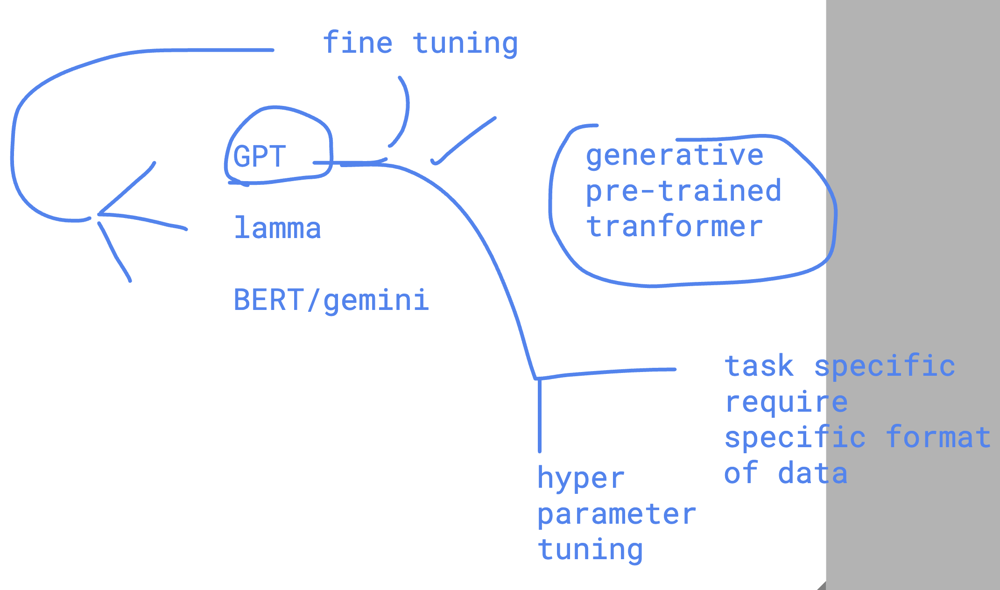
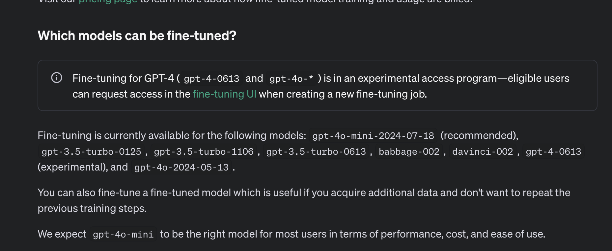
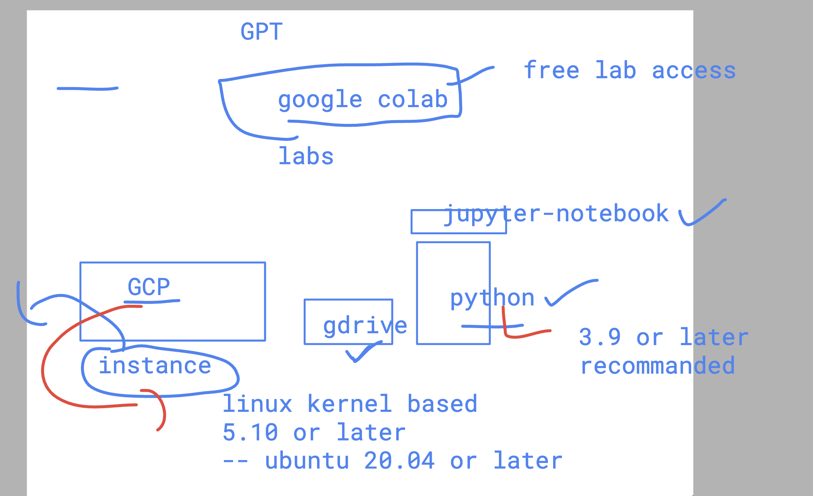
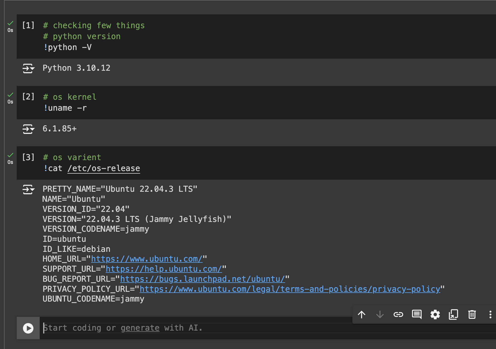

# Intro to revision of ML basics

### ML models to accuracy score journey 

## ML outliers

### ANN understanding 

### DL models type 

## Intro to LLM 

### foundation models 

-  Pre-trained LLM 

## foundation models example 

### domain specific foundataion model

## Fine tuning of GPT foundation model 

## use docs for fine tuning 

[click_here](https://platform.openai.com/docs/guides/fine-tuning)

### GPT models to fine tune 

### google colab 

### colab -- lab testing 

