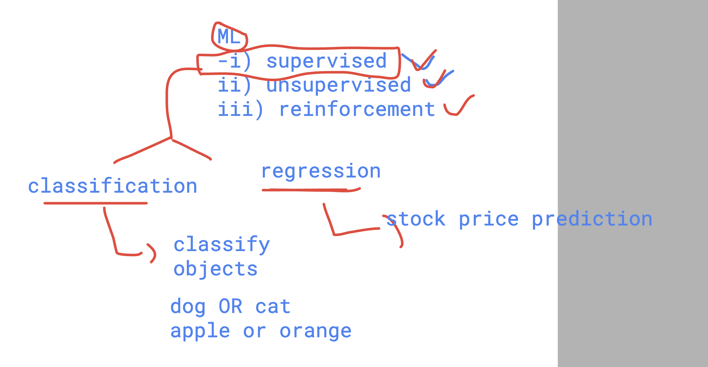
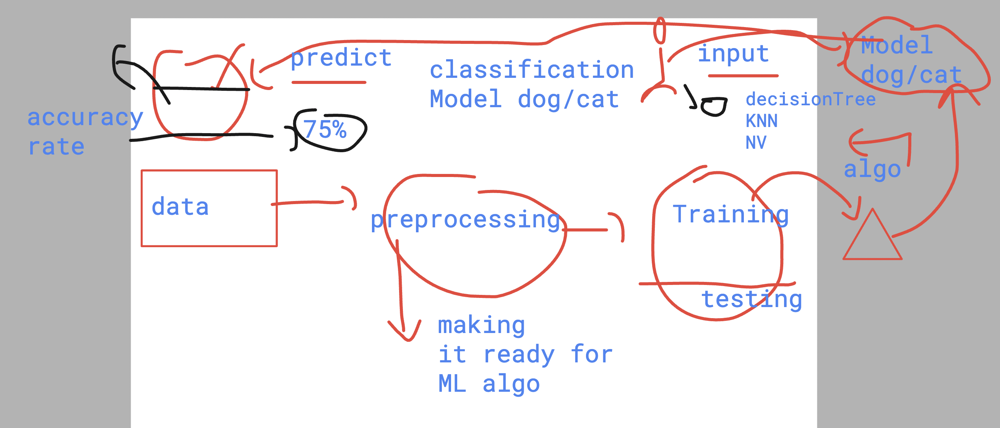
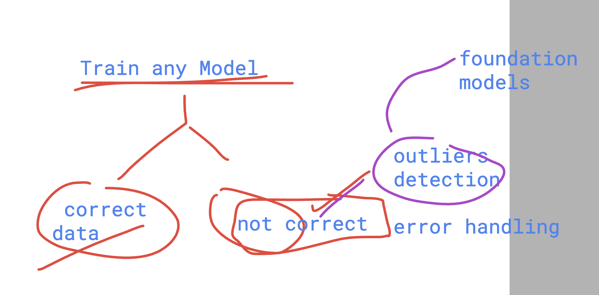
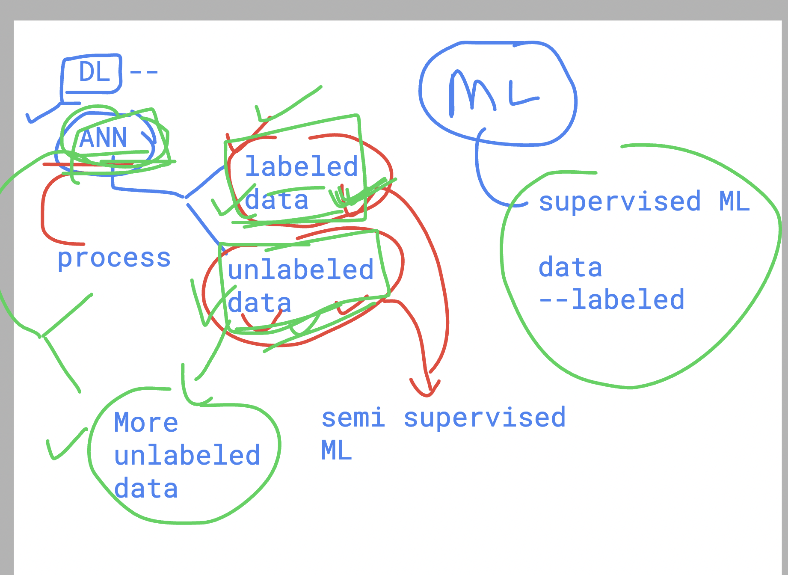
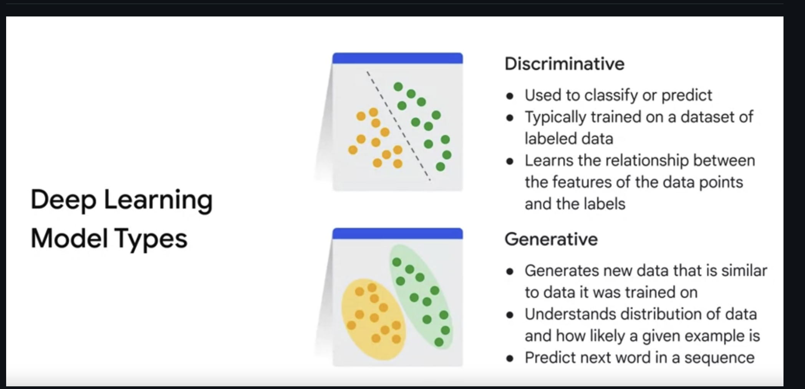
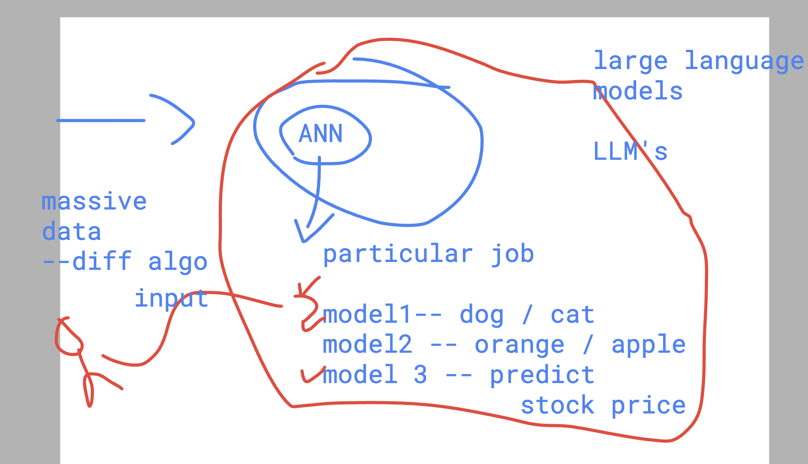
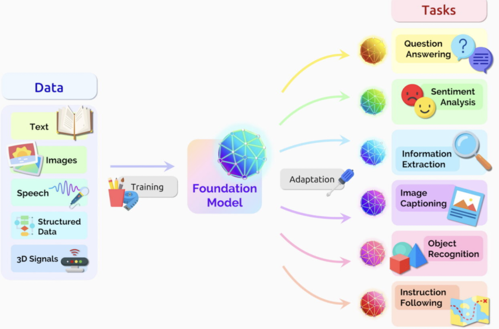
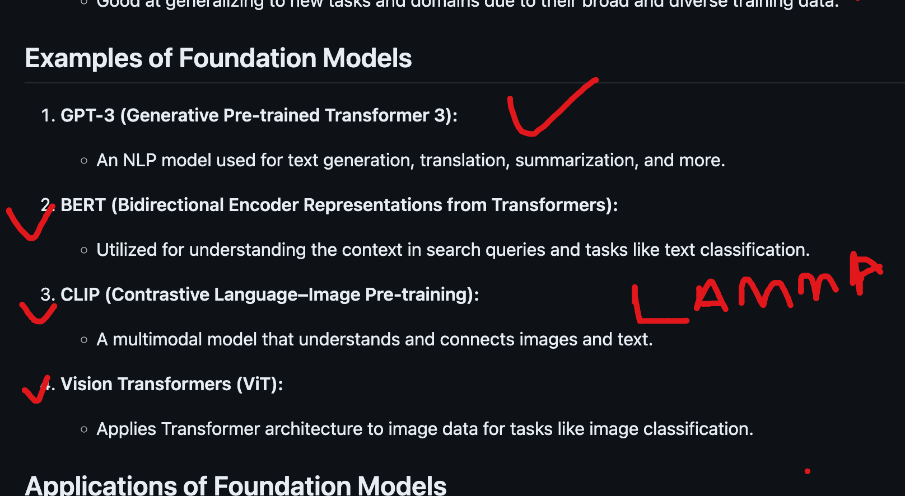
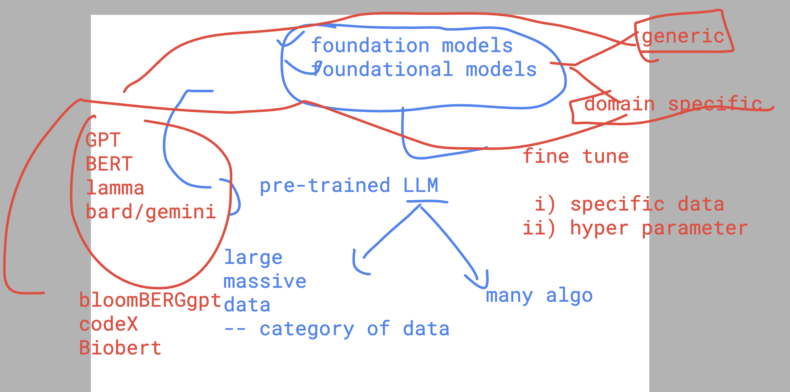

# Intro to revision of ML basics

### ML models to accuracy score journey 

## ML outliers

### ANN understanding 

### DL models type 

## Intro to LLM 

### foundation models 

-  Pre-trained LLM 

## foundation models example 

### domain specific foundataion model

