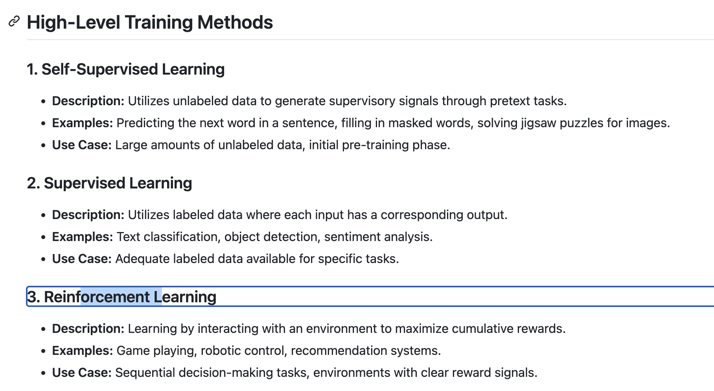
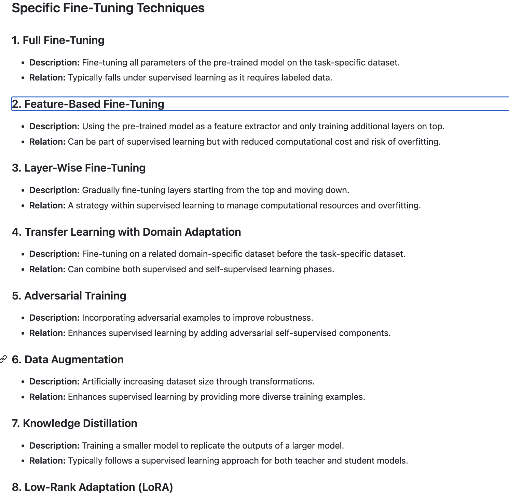
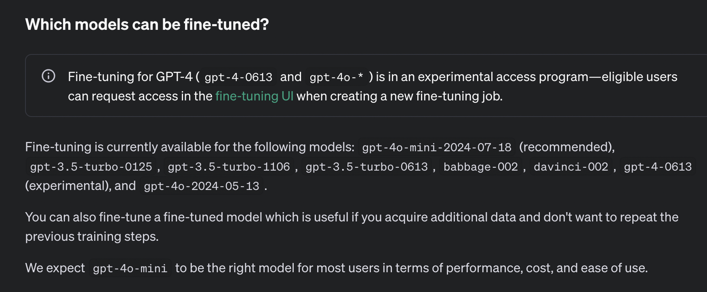

## Fine tuning of FM methods 

### high level training methods

### specific fine tune 

### understanding GPT model versions for fine tuning 

### if you want to use existing data use give repo 

[click_here](https://github.com/redashu/Datasets.git)

### some jsonL dataset on hugging face 

[click_to_check](https://huggingface.co/datasets/cognitivecomputations/samantha-data)

